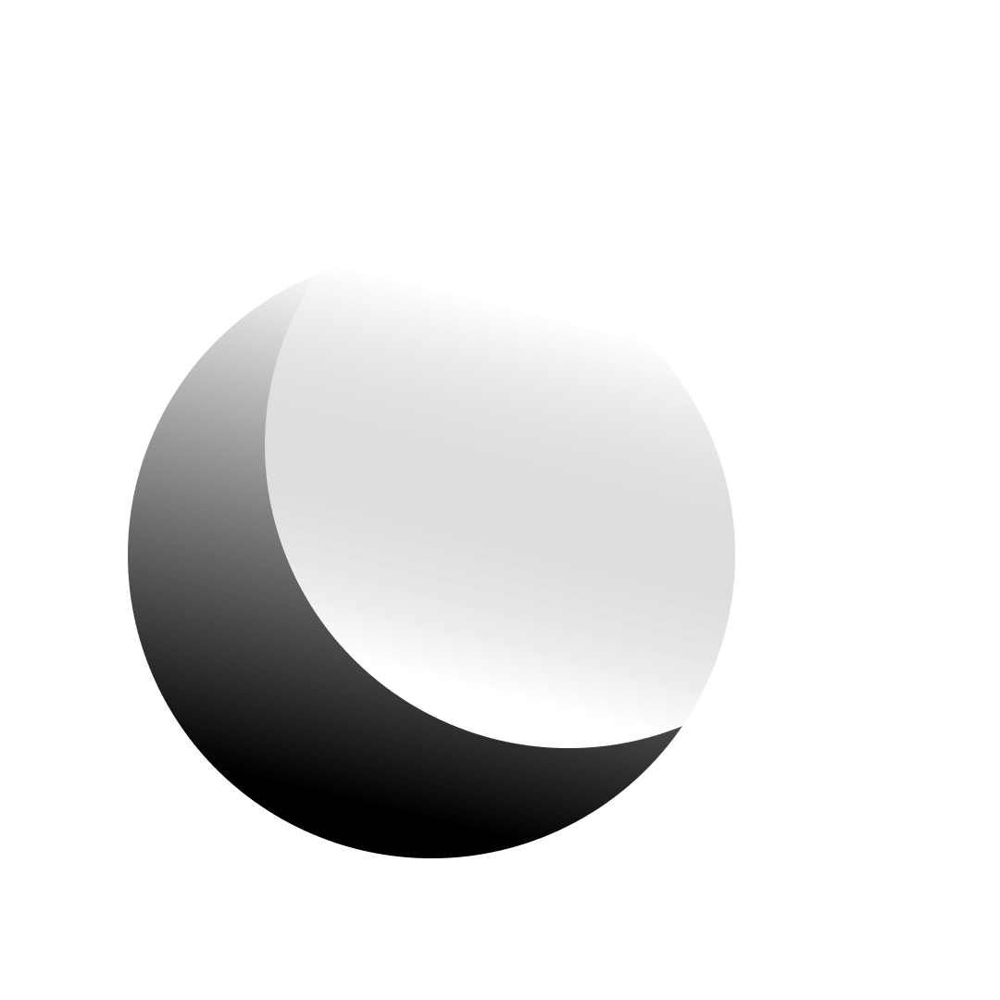

<div align="center">
  <h1>React Glass<h1/>
  
</div>

<div align="center">
  <h2>Create React components with a glassmorphism style quickly. 
<h2/>
  
</div>

## Install:
```console
yarn add https://github.com/ErickDevv/react.glass
```


## GlassForm:
First you need to create a function that will be called every time the value of the input changes (the parameter it will receive will be the value). In this case, a state was created that is updated every time the function is called in order to make use of it.

```js
const [getFirtsInput, setFirstInput] = useState('')

const changeFirstInput = (e: any) => {
  setFirstInput(e.target.value)
}
```
  <br/>
  
Now we should have our component imported:
  
```js
import { GlassForm } from 'react.glass'
```
   <br/>
  
We declare our component and pass the setters as props, which are those functions that will be called when making changes to the inputs, we also have the click prop that receives a function that will be called when submitting the form, and finally we have buttonText that receives the text which will have the submit button.
  
```js
<GlassForm setters={[changeFirstInput, changeSecondInput]} click={() => {
    setFirstInput("")
}} buttonText="Submit "></GlassForm>
```

## GlassButton:

We import our component:
  
```js
import { GlassButton } from 'react.glass'
```
```js
<GlassButton style={{ marginRight: "10px", marginLeft: "10px" }} icon={'i'm a button'} />
```
