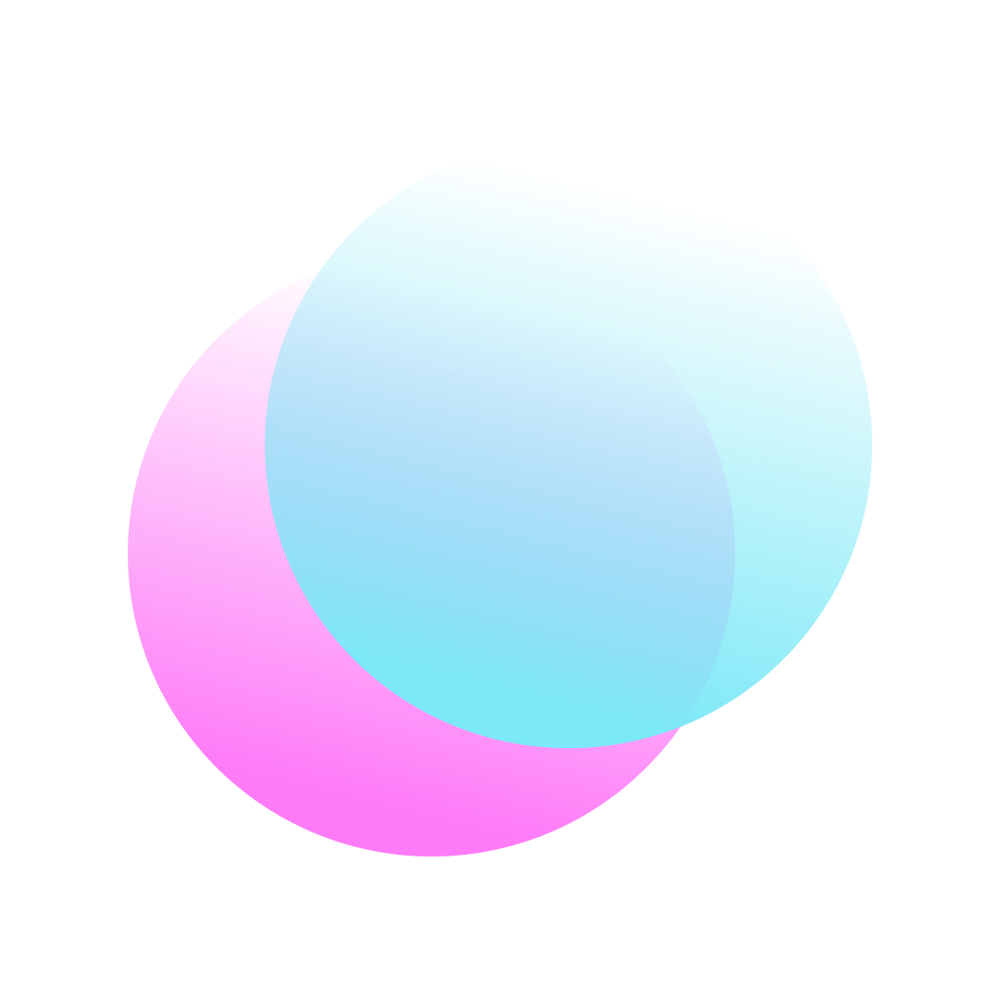

<div align="center">
  <h1>React Glass<h1/>
  
</div>

<div align="center">
  <h2>Create React components with a glassmorphism style quickly. 
<h2/>
  
</div>

## Install:
```console
yarn add https://github.com/ErickDevv/react.glass
```


## GlassForm:
First you need to create a function that will be called every time the value of the input changes (the parameter it will receive will be the value). In this case, a state was created that is updated every time the function is called in order to make use of it.

```js
const [getFirtsInput, setFirstInput] = useState('')

const changeFirstInput = (e: any) => {
  setFirstInput(e.target.value)
}
```
